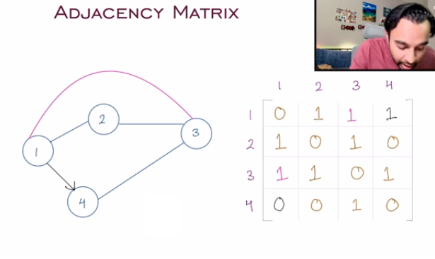
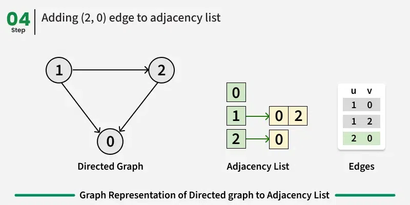
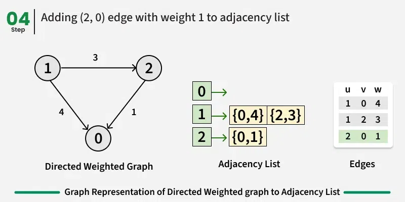
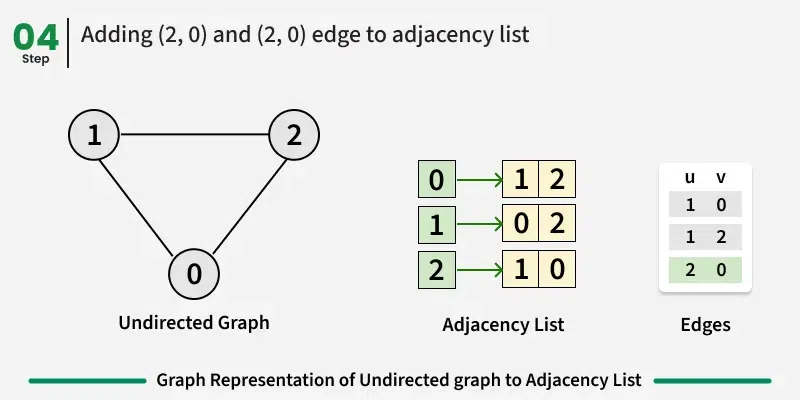
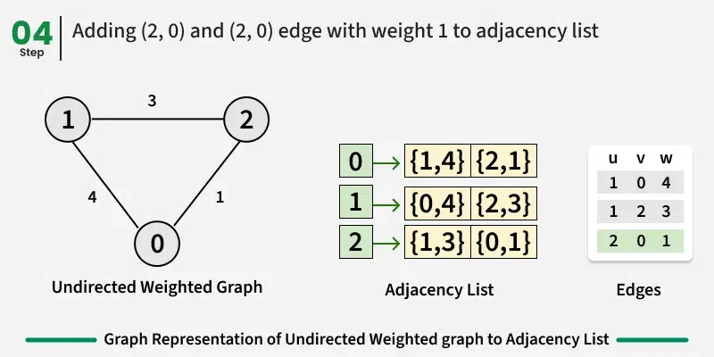

# Intro

- Graph is a collection of nodes and edges.
- G = {E, V}
- Nodes are also called vertex, vertices. 
- Edges of are also called connections, relationships.

## Degree of a node

- Degree = number of nodes to which a given node is connected to.
- Incoming degree is number of incoming edges to a given node.
- Outgoing degree is number of outgoing edges froma  given node.

## Types of graph

**1. Finite Graph**

- A graph G=(V,E) is called a finite graph if the number of nodes and edges is limited in number. e.g. Graph connecting all the countries in the world.

**2. Infinite Graph**

- A graph G=(V,E) is called an inifinite graph if there's no limit to the number of nodes and edges which it can have. e.g. Graph connecting all the sites of the world as number of sites is ever growing.

**3. Simple graph**

- A graph G=(V,E) is called a simple graph if there's only one connection between any given pair of nodes. e.g. a network of friends, between two friends there'll be only one connection denoting friendship.

**4. Multi graph**

- A graph G=(V,E) is called a multi graph if there are more than one connections between any given pair of nodes. e.g. graph of roads and cities.

**5. Trivial graph**

- A graph G=(V,E) is a trivial graph if it has just one node and no connections.

**6. Null graph**

- A graph G=(V,E) is called a null graph if it's none of it's nodes are connected to each other.

**7. Pseudo graph**

- A graph G=(V,E) is called a pseduo graph is one or more of it's node has a connection to itself(self-loop).

**8. Regular graph**

- A graph G=(V,E) is called a regular graph is each nodes have same degree.

**9. Weighted graph**

- A graph G=(V,E) is called a labeled/weighted graph if it's edges has some value. This value represents cost of going from node A to node B. e.g. network of cities wherein edges represent nodes and length of the nodes.

- Graph whose edges don't have weight are called unweighted or unlabelled graph.

**10. Directed graph**

- A graph G=(V,E) is called directed graph if it's edges have a direction(to or from) in which traversal can happen.

- Graphs which don't have direction info are called undirected graph.

**11. Complete graph**

- A graph G=(V,E) is called a complete graph if each node is connected to every other node. Degree of node n in complete graph is n - 1.

**12. Connected graph**

- A graph in which one node can be reached from another directly or indirectly. Also called joint graphs.

- Graphs in which one node/component cannot be from one(any one of the ...) othrer nodes either directly or indirectly are called disconnected or disjoint graphs.

**13. Cyclic graph**

- Graph which has at least one cycle i.e. if we start traversal from a node then there's a path which brings us back to that node.

- Graph without cycles are called acyclic.

**14. Directed acyclic graph**

- DAG: Directed acyclic graph are directed graphs without any cycles.

**15. Sub graph**

- A certain portion of a graph.

## Graph Representation

### 1. Adjacency Matrix

- Graphs are represented as a binary square matrix. 1 means that an edge is there between node i and node j, 0 means no edge exist.



#### Characteristics of the adjacency matrix are:

- The size of the matrix is determined by the number of vertices (or nodes) in a graph.
- The edges in the graph are represented as values in the matrix. In case of unweighted graphs, the values are 0 or 1. In case of weighted graphs, the values are weights of the edges if edges are present, else 0.
- If the graph has few edges, the matrix will be sparse.

#### Applications of the Adjacency Matrix:

- Graph algorithms: Many graph algorithms like Floyd-Warshall algorithm
- Image processing: Adjacency matrices are used in image processing to represent the adjacency relationship between pixels in an image.
- Finding the shortest path between two nodes: By performing matrix multiplication on the adjacency matrix, one can find the shortest path between any two nodes in a graph.

#### Advantages of using Adjacency Matrix:

- Simple to implement
- Efficient for dense graph
- Quick queries O(1) to know if nodes are connected.

#### Disadvantages of using Adjacency Matrix:

- Space inefficient - complexity - O(n^2).
- Expensive ops like adding or removing nodes especially in case of dyncamic graphs where we frequently add or remove nodes.
- Nodes should have sequential ids

#### How to build an Adjacency Matrix:

It is very easy and simple to construct an adjacency matrix for a graph there are certain steps given below that you need to follow:

- Create an n x n matrix where n is the number of vertices in the graph.
- Initialize all elements to 0.
- For each edge (u, v) in the graph, if the graph is undirected mark a[u][v] and a[v][u] as 1, and if the edge is directed from u to v, mark a[u][v] as the 1. (Cells are filled with edge weight if the graph is weighted)

#### Simple directed adj matrix representation in java

```java
// For undirected, just repeat the operation in the 'from' node too.
package org.experiments;

public class Main {

    private int size;
    private int[][] matrix;

    private void initGraph(int size) {
        int[][] matrix = new int[size][size];
        for(int i=0; i<size; i++) {
            for(int j=0; j<size; j++) {
                matrix[i][j] = 0;
            }
        }
        this.matrix = matrix;
        this.size = size;
    }

    private void addEdge(int from, int to) {
        if(from < matrix.length && to < matrix[0].length) {
            matrix[from][to] = 1;
            System.out.println("Added edge");
        } else {
            System.out.println("One of the nodes is not present");
        }
    }

    private void removeEdge(int from, int to) {
        if(from < matrix.length && to < matrix[0].length) {
            matrix[from][to] = 0;
            System.out.println("Removed edge");
        } else {
            System.out.println("One of the nodes is not present");
        }
    }

    private void addNode() {
        int[][] matrix = new int[size + 1][size + 1];
        for(int i=0; i<size; i++) {
            for(int j=0; j<size; j++) {
                matrix[i][j] = this.matrix[i][j];
            }
        }
        this.size = this.size + 1;
        this.matrix = matrix;
    }

    private void removeNode(int n) {
        // Since this is a simple implementation, we only have functionality
        // to remove the last node. If we removed a node from middle
        // then we'll have to shift all the subsequent nodes to one position before
        // but that will also change node values which is not desired. This holds
        // true because of the nature of our graphs.
        if(n != this.matrix.length - 1) return;

        int[][] matrix = new int[size - 1][size - 1];
        for(int i=0; i<size - 1; i++) {
            for(int j=0; j<size - 1; j++) {
                matrix[i][j] = this.matrix[i][j];
            }
        }
        size = size - 1;
        this.matrix = matrix;
    }

    private void printGraph() {
        for(int i=0; i<size; i++) {
            StringBuilder row = new StringBuilder();
            for(int j=0; j<size; j++) {
                row.append(matrix[i][j]);
                if(j != size - 1) row.append(',');
            }
            System.out.println(row);
        }
    }

    public static void main(String[] args) {
        // render adj matrix on this site - graphonline.top/en/
        Main ob = new Main();
        ob.initGraph(3);
        ob.addEdge(0, 2);
        ob.addEdge(0, 1);
        ob.addEdge(1, 2);
        ob.printGraph();
        ob.addNode();
        ob.addEdge(0,3);
        ob.addEdge(1,3);
        ob.printGraph();
        ob.removeNode(3);
        ob.printGraph();
    }
}
```

### 2. Adjacency List

An adjacency list is a data structure used to represent a graph where each node in the graph stores a list of its neighboring vertices.

**Adjacency List for Directed graph**

Consider an Directed and Unweighted graph G with 3 vertices and 3 edges. For the graph G, the adjacency list would look like:



**Adjacency List for Directed and Weighted graph**

Here we store information about edge weight in the connected(to) node.



**Adjacency List for Undirected graph**

Consider an Undirected and Unweighted graph G with 3 vertices and 3 edges. For the graph G, the adjacency list would look like:



**Adjacency List for Undirected and Weighted graph**

Here also, we just store weight info



#### Characteristics of the Adjacency List

- An adjacency list representation uses a list(or map) of lists. We store all adjacent of every node together.
- The size of the list is determined by the number of vertices in the graph.
- All adjacent of a vertex are easily available. To find all adjacent, we need only O(n) time where is the number of adjacent vertices.

#### Applications of the Adjacency List

- Graph algorithms: Many graph algorithms like Dijkstra's algorithm, Breadth First Search, and Depth First Search perform faster for adjacency lists to represent graphs.
- Adjacency List representation is the most commonly used representation of graph as it allows easy traversal of all edges.

#### Pros

- Space efficient
- Good for sparse graphs
- Efficient for dynamic graphs(graphs with frequent node insertion and deletion).
- Works well for lots of algorithms like dfs, bfs, djikstra etc.

#### Cons

- Less intuitive for dense graphs.
- Checking if two nodes are connected is slower wrt adj. matrix.
- Additional overhead for storing pointers.

#### Simple adj list representation in java

```java
// It's a simple implementation so no checks are there
// In a real world imp, there will be many checks
// I've intentionally left comments from few methods and it's upto
// reader to make reasonable conclusions
public class Main {

    Map<Integer, List<Integer>> graph = new HashMap<>();

    private void addNode(int n) {

        // in a real implementation we would have more thorough
        // checks like if the node is not already there etc.
        graph.put(n, new LinkedList<>());
    }

    private void removeNode(int n) {
        // removing node from graph
        graph.remove(n);

        // removing all connections to it ...
        for(List<Integer> adjNodes : graph.values()) {
            adjNodes.remove(n);
        }
    }

    private void addEdge(int from, int to) {

        // in real world, we can check if a connection is not already there ...
        graph.get(from).add(to);
    }

    private void removeEdge(int from, int to) {
        // here we are converting to from primitive to a wrapper obj type
        // if we just pass in the primitive, remove method will
        // try to remove the object at the index of "to" not the 
        // actual object whose value was same as to
        graph.get(from).remove(Integer.valueOf(to));
    }

    private void printGraph() {
        for(Map.Entry<Integer, List<Integer>> set : graph.entrySet()) {
            System.out.println(set.getKey() + "->" + set.getValue());
        }
    }

    public static void main(String[] args) {
        Main ob = new Main();
        ob.addNode(1);
        ob.addNode(2);
        ob.addNode(3);
        ob.addEdge(1, 3);
        ob.addEdge(3, 2);
        ob.addEdge(2, 1);
        ob.addEdge(1,2);
        ob.printGraph();
        ob.removeEdge(1, 2);
        ob.printGraph();
    }
}
```

### 3. Node data structure based representation

This is what we'll see in real world more frequently. Instead of storing raw values we'll store data in nodes. This is a form of adj. list only.

```java
class Node {
    int value;
    List<Node> connectedNodes;
}

Set<Node> graph;
```

## Graph Traversal

### DFS - Depth First Search/Approach

Depth First Search (DFS) is a graph traversal algo that starts from a source node and explores each path completely(hence depth in name) before backtracking and exploring other paths. To avoid revisiting nodes in graphs with cycles, a visited array is used to track visited vertices.

In a disconnected graph, some vertices may not be reachable from a single source. To ensure all vertices are visited in DFS traversal, we iterate through each vertex, and if a vertex is unvisited, we perform a DFS starting from that vertex being the source. This way, DFS explores every connected component of the graph.

**Time complexity:** O(V + E), where V is the number of vertices and E is the number of edges in the graph.

**Space complexity/auxiliary space:** O(V + E), since an extra visited array of size V is required, And stack size for recursive calls to dfsRec function.

**Uses set**

DFS can be done either iteratively or recursively.

#### Uses

1. Maze solving
2. Flood fill
3. Path existence
4. Connected components
5. Cycle detection
6. Backtracking
   
#### Algo

- Have a stack and a set to know the visited nodes.
- Start with source node, add it to stack.
- While stack is not empty
  - Pop one node (top node ofc)
  - If it's not there in visited set.
    - Add it to to visited set.
    - Add all it's children to stack.
  - If it's in visited set, don't revisit it.
  
#### Sample iterative dfs on connected graph(taken from adj. list impl above), this just traverses the entire graph

```java
void dfs(int start) {
    Set<Integer> visited = new HashSet<>();
    Stack<Integer> st = new Stack<>();
    st.add(start);

    while(!st.isEmpty()) {
        int node = st.pop();

        // do not retraverse the node if it's already visited once
        if(visited.contains(node)) continue;

        System.out.println("At node: " + node);

        // add it to visited node
        visited.add(node);
        List<Integer> adjacentNodes = graph.get(node);
        if(adjacentNodes == null || adjacentNodes.isEmpty()) continue;

        for(Integer i : adjacentNodes) {
            st.push(i);
        }
    }
}
```

#### Sample recursive dfs

Here we don't use stack explicitly but instead function call stack provides the same function.

```java
void dfs(int start, Set<Integer> visited) {

    // add to visited set, we don't really need to check
    // if it was visited before as we are only visiting unvisited nodes at all times.
    visited.add(start);
    System.out.println("At node: " + start);

    for(Integer i : graph.get(start)) {
        if(!visited.contains(i)) {
            dfs(i, visited);
        }
    }
}

public static void main(String[] args) {
    // exact type of hashset is inferred from the type used in method parameter
    ob.dfs(0, new HashSet<>());
}
```

**Question keywords: Find the node, if a connection exists, deepest path etc.**

### BFS - Breadth First Search/Approach

Breadth First Search (BFS) is a graph traversal algorithm that starts from a source node and explores the graph level by level. First, it visits all nodes directly adjacent to the source. Then, it moves on to visit the adjacent nodes of those nodes, and this process continues until all reachable nodes are visited.

**BFS is different from DFS in a way that closest vertices are visited before others. We mainly traverse vertices level by level. Thus it's also called level order traversal.**

In a disconnected graph, some vertices may not be reachable from a single source. To ensure all vertices are visited in BFS traversal, we iterate through each vertex, and if any vertex is unvisited, we perform a BFS starting from that vertex being the source. This way, BFS explores every connected component of the graph.

***Time Complexity:** O(V + E), The for loop ensures BFS starts from every unvisited vertex to cover all components, but the visited array ensures each vertex and edge is processed only once, keeping the total time complexity to be linear.

**Space complexity:** O(V), using a queue to keep track of the vertices that need to be visited. 

**Uses queue**

**Exact same algo as dfs but we use queue instead of stack**

Iterative implementation is the commonimpl technique for bfs, recusrive isn't of any real value add and is not really used.

#### Uses

1. Family tree traversal
2. Level order traversal of tree(every tree is a graph!)
3. Shortest path

#### Algo

- Have a queue and a set to know the visited nodes.
- Start with source node, add it to queue.
- While queue is not empty
  - Dequeue/poll one node (top node ofc)
  - If it's not there in visited set.
    - Add it to to visited set.
    - Enqueue/offer all it's children to queue.
  - If it's in visited set, don't revisit it.

#### Iterative

```java
void bfs(int start) {
    Set<Integer> visited = new HashSet<>();
    Queue<Integer> queue = new LinkedList<>();
    queue.add(start);

    while(!queue.isEmpty()) {
        int node = queue.poll();

        // do not retraverse the node if it's already visited once
        if(visited.contains(node)) continue;

        System.out.println("At node: " + node);

        // add it to visited node
        visited.add(node);
        List<Integer> adjacentNodes = graph.get(node);
        if(adjacentNodes == null || adjacentNodes.isEmpty()) continue;

        for(Integer i : adjacentNodes) {
            queue.offer(i);
        }
    }
}
```

**Question keyword: Find the shortest path**

# Sources

- https://www.youtube.com/playlist?list=PLFdAYMIVJQHNFJQt2eWA9Sx3R5eF32WPn
- https://www.geeksforgeeks.org/dsa/adjacency-matrix-meaning-and-definition-in-dsa/
- https://www.geeksforgeeks.org/dsa/adjacency-list-meaning-definition-in-dsa/
- https://www.geeksforgeeks.org/dsa/depth-first-search-or-dfs-for-a-graph/